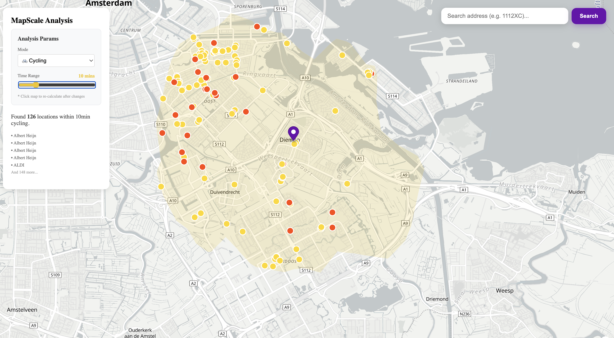
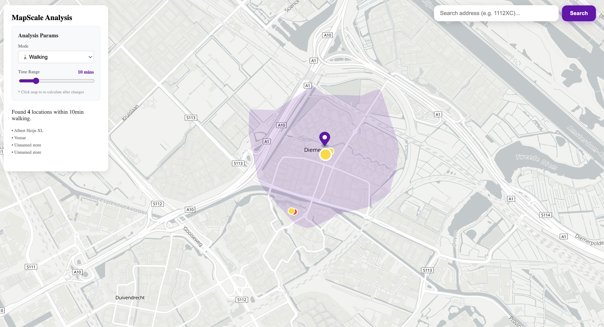

# MapScale Analysis Tool 



A professional-grade geographic analysis tool built for urban accessibility and POI (Point of Interest) density studies. This project demonstrates the integration of complex spatial data with a modern reactive web stack.

## Tech Stack
* Frontend: React (Vite), MapLibre GL, Turf.js, Axios

* Backend: FastAPI (Python), HTTPX

* Data Providers: OpenRouteService (Isochrones), OpenStreetMap/Overpass API (POIs), Nominatim (Geocoding)

## Core Features
* Dynamic Isochrones: Calculate travel boundaries based on time (5-30 mins) and mode (Walking, Cycling, Driving) using real-world road networks.

* Reactive POI Analysis: Real-time filtering of supermarkets and gyms within the actual street-network boundary using the Turf.js spatial engine.

* Smart Address Search: Locate any address (e.g., 1112XC Diemen) with smooth "FlyTo" animations and automatic re-calculation.

* Operational Status: Integrated opening_hours logic to parse OSM data and display real-time status: Open Now, Closed, or Data Unknown.

## Engineering Insights: Map Rendering Logic
During development, I focused heavily on understanding the Map Rendering Pipeline. One of the major challenges was solving the "Marker Drifting" issue:

* The "Floating Point" Challenge: Initially, markers appeared to "drift" or lag behind when the map was zoomed or panned.

* Deep Understanding: I realized this was caused by a conflict between React's state-driven DOM updates and MapLibre's high-frequency coordinate-to-pixel projection.

* The Solution: By decoupling the UI state from the raw coordinate updates and strictly managing the Marker lifecycle (properly mounting/unmounting DOM elements via MapLibre's internal setLngLat API), I achieved perfect synchronization where markers remain pinned to their geographic coordinates regardless of map movement.

## System Architecture
### Backend (FastAPI)
* Parameterized Routing: Dynamically maps frontend profiles (walking/driving) to ORS routing engines.

* Adaptive Radius Querying: Automatically scales the Overpass QL around radius based on the selected travel mode to ensure sufficient data coverage.

* Resilience: Implemented custom HTTPX timeout and error handling for high-latency spatial queries.

### Frontend (React)
* Declarative Logic: Used useEffect observers to trigger data fetching only when core parameters (minutes, mode, centerLoc) change.

* Spatial Computing Layer: Utilizes useMemo to perform point-in-polygon collisions in the browser, ensuring the UI remains performant even with hundreds of POIs.

## Future Roadmap: AI Agent Integration
The next phase of this project involves pushing into the Geo-AI space:

* Natural Language GIS: Integrating an AI Agent (e.g., GPT-4o) to allow users to use voice commands: "Find me all gyms within a 15-minute walk of Diemen Zuid that are open right now."

* Auto-API Invocation: The Agent will parse intent, map it to our existing FastAPI endpoints, and visualize the results automatically.

* Smart Routing: Adding one-click navigation from the user's center point to any filtered POI.

## Getting Started

### 1. Prerequisites
* Python 3.10+

* Node.js 18+

* An API Key from OpenRouteService

### 2. Clone the repo:
``` git clone https://github.com/boyee-zhang/mapscale-analysis-tool.git
cd mapscale-analysis-tool
```

### 3. Frontend Setup:
```bash
cd frontend
npm install
npm run dev
```
### 4. Backend Setup:
```bash
cd backend
python -m venv venv
source venv/bin/activate  # Windows: venv\Scripts\activate
pip install -r requirements.txt
echo "ORS_API_KEY=your_key_here" > .env
uvicorn main:app --reload
```

The application will be available at http://localhost:5173.

This is just the start. Let's keep building, keep learning, and keep discovering. 🚀

**Happy New Year!** 🎇